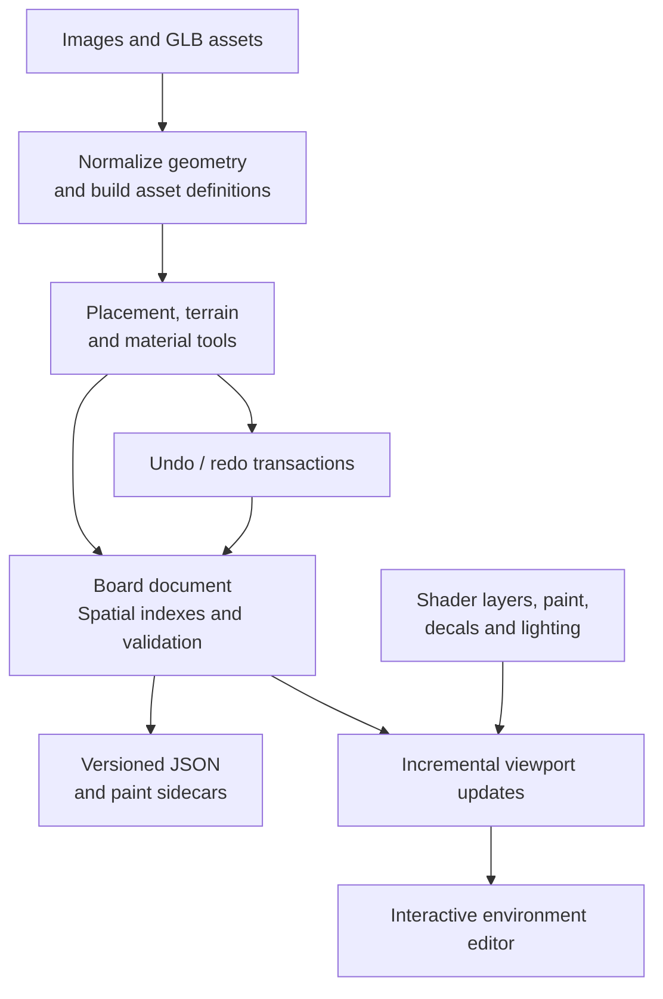

# Modular Tile Kit Studio

**A native Godot editor for building modular isometric environments, with terrain, materials, props, lighting, and structured level data in one workspace.**

I built the studio to make detailed environments authorable through a constrained spatial vocabulary. Its grid, asset definitions, and board documents make the relationship between authored geometry and structured level data explicit.

The work brings together asset import and geometric normalization, spatial indexes
and placement rules, terrain generation, GPU materials, paint and decals, and
editor interaction with undo/redo. I designed the board data model and rendering
system together so that visual authoring produces structured, persistent level data.

The editor source, board schema, importers, shader system and companion Blender
tools below document the systems I built and how they fit together.

## From assets to an authored environment

## Engineering highlights

- **Native editor tooling:** a Godot main-screen plugin with placement tools, inspectors, terrain sculpting, lighting/material panels, and undo/redo.
- **Graphics infrastructure:** heightfield mesh construction, GPU shaders, painted material layers, surface blending, decals, and derived-map processing.
- **Geometry-to-spatial-data pipeline:** GLB import and canonical transforms, proportional sizing, mesh processing, voxel occupancy, and placement validation.
- **Structured authoring state:** canonical board/resources, JSON serialization, editor automation, background processing, optional ComfyUI integration.

## Explore the code

| Area | Starting point |
|---|---|
| Plugin lifecycle | [plugin.gd](addons/modular_tile_studio/plugin.gd) |
| Boards, assets, and profiles | [data/](addons/modular_tile_studio/data/) |
| Meshes, shaders, and materials | [rendering/](addons/modular_tile_studio/rendering/) |
| Terrain authoring | [generation/](addons/modular_tile_studio/generation/) |
| Image and GLB ingestion | [importers/](addons/modular_tile_studio/importers/) |
| Panels and interaction | [ui/](addons/modular_tile_studio/ui/), [viewport/](addons/modular_tile_studio/viewport/) |
| Image analysis and workflows | [analysis/](addons/modular_tile_studio/analysis/) |
| Asset-preparation utilities | [tools/](tools/) |
| Companion Blender add-on | [integrations/blender/](integrations/blender/) |

## Scope and construction

The studio covers modular environment authoring: asset preparation, board state,
terrain, surface materials, placement and viewport interaction. A companion Blender
extension supports grid-heightfield preparation and editing.

The editor data and rendering layers are separate from the UI. Godot classes retain
resource identities and undo callbacks while delegating behavior to named feature
modules; the main shader uses ordered includes. The
[construction and architecture guide](docs/BUILD_PROCESS.md) follows those decisions
from spatial data and asset preparation to editor interaction and rendering.
